<h1 align="center">여기콕</h1>
<p align="center"><b>서울시 공식 상권 데이터로 창업 입지를 결정하는 지도 기반 상권분석 플랫폼</b></p>

<p align="center">
  
  
  
  
  
  
  
</p>

> 4인 팀 · 2026-07-03 ~ 2026-07-14 · [www.sang.it.kr](https://www.sang.it.kr)

서울시 상권분석서비스, 서울 열린데이터광장 등 공공데이터를 지도 위에 올려 상권 1,650곳의 매출·유동인구·점포수·성장쇠퇴를 비교하고, Gemini가 그 데이터를 근거로 상권 리포트를 써준다. 기업마당·K-Startup 지원사업, 프랜차이즈·상표 동향까지 한 화면에서 확인할 수 있고, EC2 2대 + ALB로 실제 운영 배포까지 마쳤다.

<details>
<summary><b>목차 (클릭하여 펴기)</b></summary>
<br>

* [1. 팀](#1-팀)
* [2. 왜 만들었나](#2-왜-만들었나)
* [3. 핵심 기능](#3-핵심-기능)
* [4. 관리자 백오피스](#4-관리자-백오피스)
* [5. 아키텍처](#5-아키텍처)
* [6. 데이터 모델](#6-데이터-모델)
* [7. 신뢰성 · 품질](#7-신뢰성--품질)
* [8. 한계와 개선점](#8-한계와-개선점)
* [9. 실무 확장 방안](#9-실무-확장-방안)
* [10. 디렉터리 구조](#10-디렉터리-구조)
* [11. 실행](#11-실행)

</details>

---

## 1. 팀

| 프로필 | 이름 | 역할 | 담당 |
| :---: | :--- | :--- | :--- |
| <a href="https://github.com/SanghyeokLee-KR"></a> | **[이상혁](https://github.com/SanghyeokLee-KR)**<br>*팀장* | 백엔드(상권분석·지도) · 인프라 | DB 설계, 상권분석 조회 API, 지도 화면, EC2/ALB 배포, 무중단 롤링 배포 |
| <a href="https://github.com/loniskr"></a> | **[김민혁](https://github.com/loniskr)** | 백엔드(회원·인증·결제) | 로그인·세션, 찜, 토스페이먼츠 결제·구독 |
| <a href="https://github.com/mukae1956"></a> | **[곽소정](https://github.com/mukae1956)** | 백엔드(백오피스·운영) · 프론트 일부 | 관리자 인증(OTP), 공지·1:1문의, 운영 대시보드, 랜딩/백오피스 화면 |
| <a href="https://github.com/yangtori0407"></a> | **[양은영](https://github.com/yangtori0407)** | 백엔드(창업지원·콘텐츠) · 프론트 일부 | 지원사업, 업계동향, AI 상권 리포트(Gemini) |

도메인 패키지(`map` / `member` / `admin` / `support`)를 나눠 각자 백엔드부터 화면까지 책임지고, `global`(공통 응답·예외·외부 API)만 조장이 관리하며 병렬로 개발했다.

## 2. 왜 만들었나

소상공인이 창업 입지를 정할 때 참고할 데이터는 여러 기관에 흩어져 있고, 기존 상권분석 서비스는 유료 리포트 중심이라 가볍게 지역 몇 개를 비교해보고 싶은 사람에겐 진입장벽이 있다. 지원사업 정보도 기업마당·K-Startup에 따로 흩어져 있어 일일이 찾아봐야 한다.

여기콕은 서울시가 공개한 상권 데이터를 무료로 지도에서 바로 비교할 수 있게 하고, AI가 그 지표를 문장으로 풀어주는 데 집중했다. 기획 단계에서 실제로 쓸 수 있는 공공데이터인지(갱신 주기, 컬럼 구조)를 먼저 확인한 뒤 기능 범위를 정했다.

## 3. 핵심 기능

<table align="center">
<tr>
<td align="center" width="50%">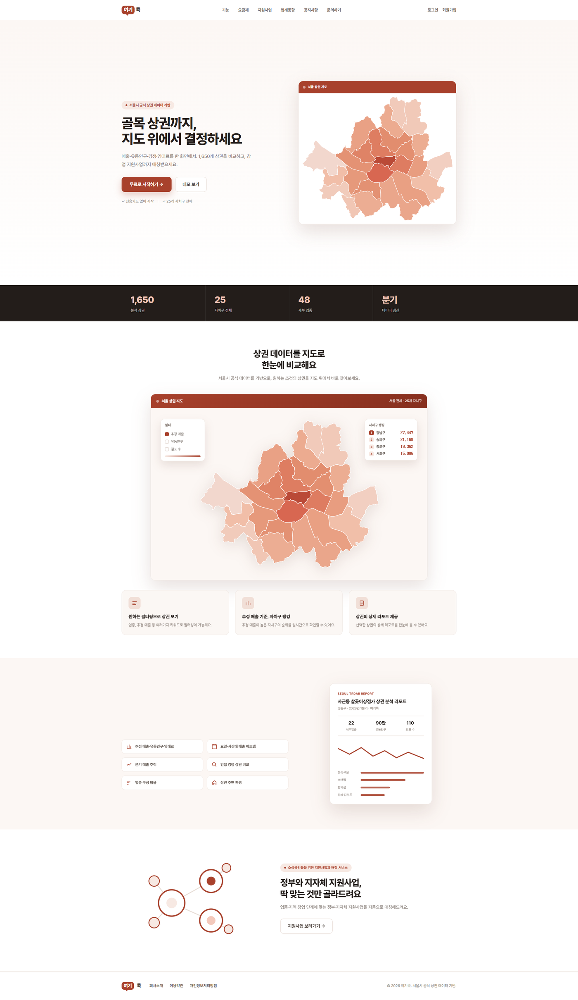<br><b>메인페이지</b><br><sub>1,650개 상권 · 25개 자치구를 지도에서 바로 탐색</sub></td>
<td align="center" width="50%">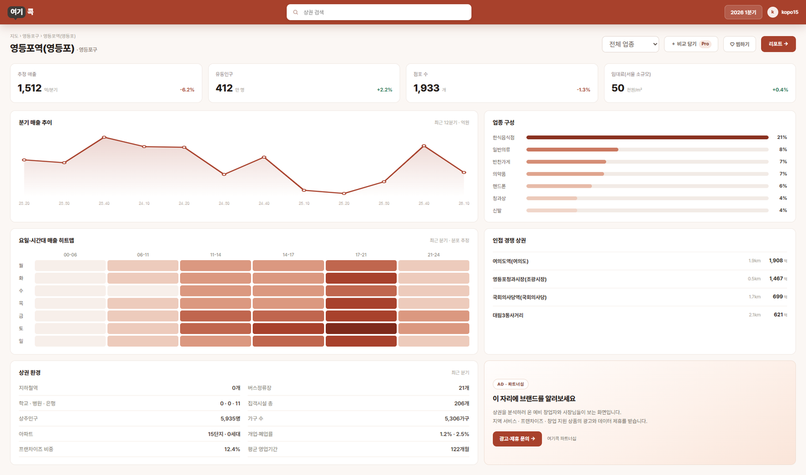<br><b>상권 상세 리포트</b><br><sub>매출·유동인구·업종구성·경쟁상권을 한 장으로</sub></td>
</tr>
<tr>
<td align="center" width="50%">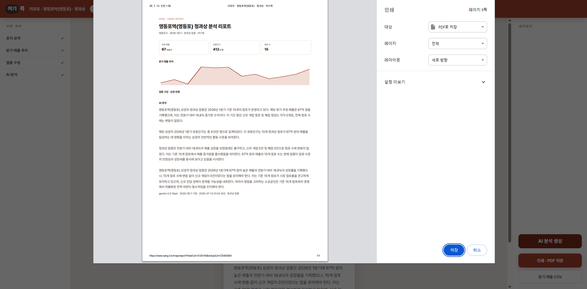<br><b>AI 리포트 · 내보내기</b><br><sub>Gemini가 매출 추이·상권 특징을 문단으로 요약, PDF·CSV로 저장</sub></td>
<td align="center" width="50%">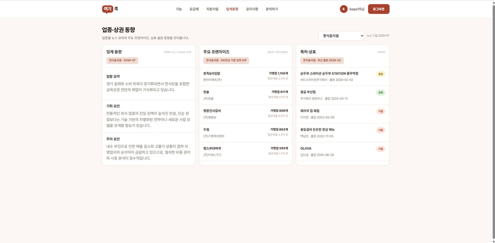<br><b>업계동향 (Pro)</b><br><sub>네이버뉴스 기반 업종 동향 + 프랜차이즈·상표 출원 현황</sub></td>
</tr>
<tr>
<td align="center" width="50%">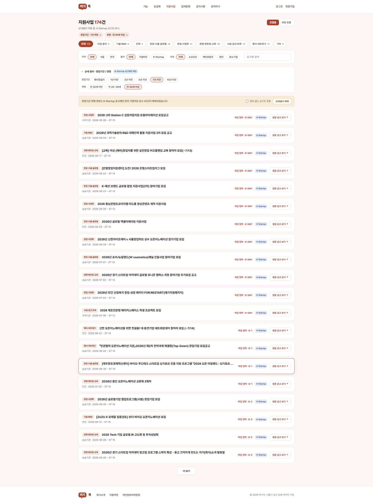<br><b>지원사업 매칭</b><br><sub>기업마당·K-Startup 공고를 지역·대상·창업기간으로 필터링</sub></td>
<td align="center" width="50%">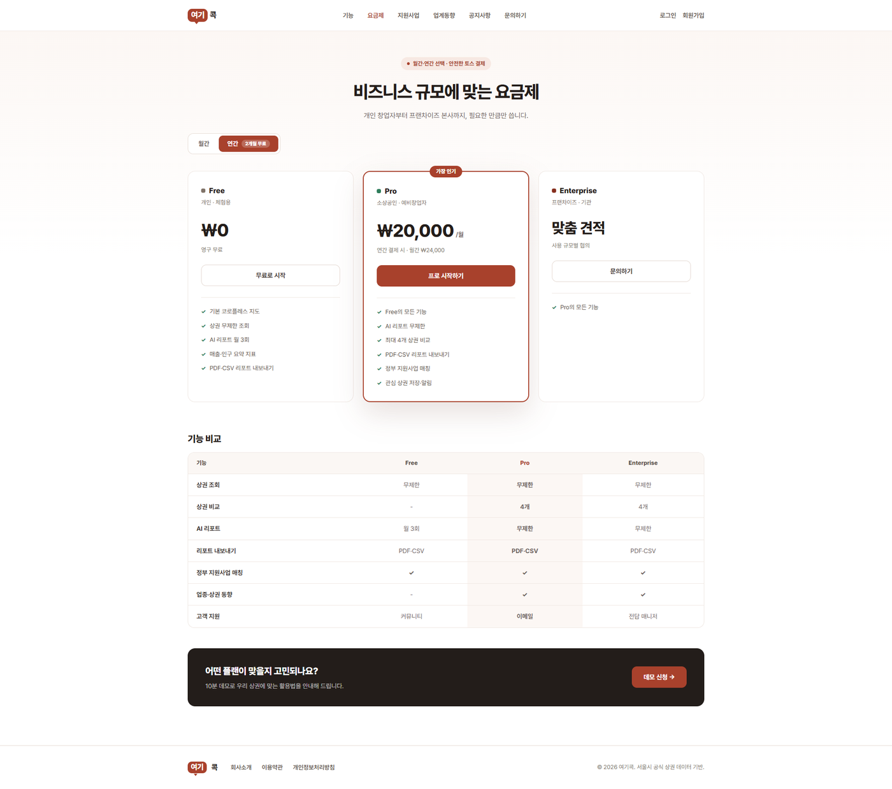<br><b>요금제 · Pro 결제</b><br><sub>토스페이먼츠 위젯, 월/연 결제, 실패·취소까지 서버가 상태로 검증</sub></td>
</tr>
</table>

무료로도 지도·리포트(월 3회)·지원사업·공지사항을 충분히 쓸 수 있고, 업계동향·상권별 비교 분석·AI 리포트 무제한은 Pro 전용이다.

## 4. 관리자 백오피스

일반 회원은 접근할 수 없는 운영 전용 콘솔이다. 화면 14개, API 51개로 구성되고 최고관리자(SUPER_ADMIN)와 역할 기반 권한(RBAC)으로 접근을 나눴다.

<table align="center">
<tr>
<td align="center" width="50%">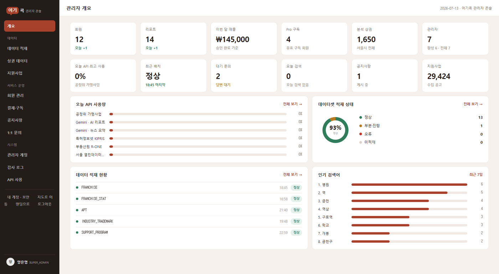<br><b>대시보드</b><br><sub>회원·매출·문의·API 사용량을 한 화면에서</sub></td>
<td align="center" width="50%">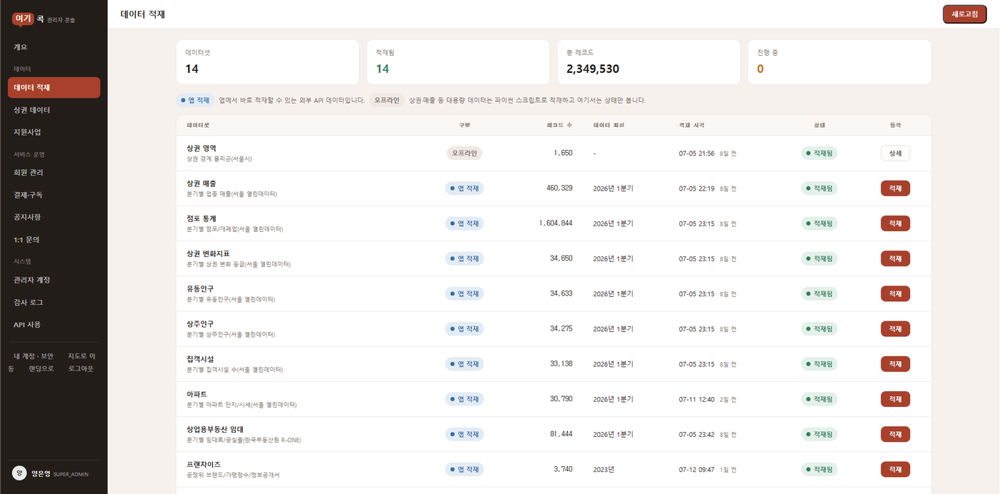<br><b>데이터 적재 현황</b><br><sub>수집 데이터셋별 최신 갱신 일자 확인, 직접 재적재</sub></td>
</tr>
<tr>
<td align="center" width="50%">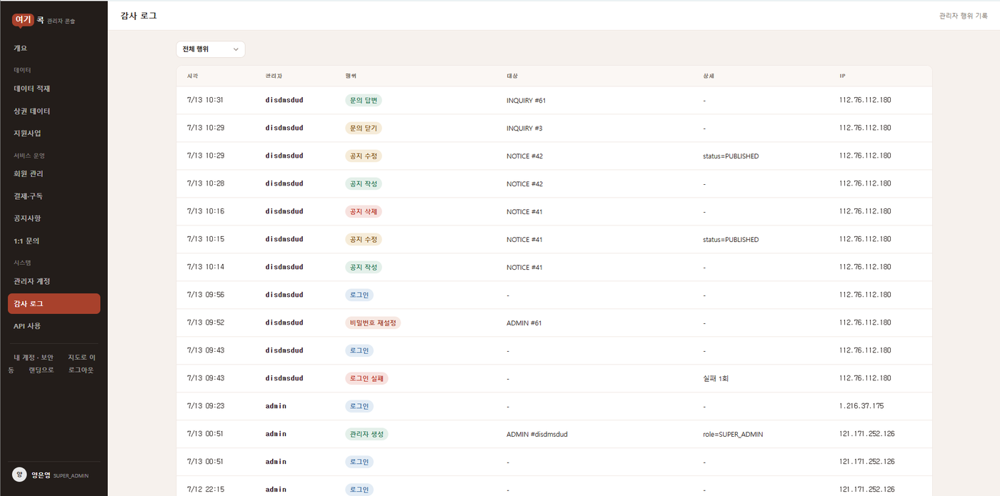<br><b>감사로그</b><br><sub>관리자 행위·대상·IP를 전부 기록</sub></td>
<td align="center" width="50%">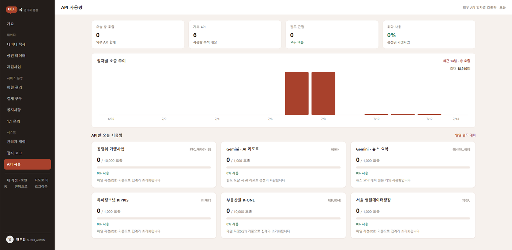<br><b>외부 API 사용량</b><br><sub>공정위·Gemini·KIPRIS 등 연동 API별 한도 관리</sub></td>
</tr>
</table>

## 5. 아키텍처

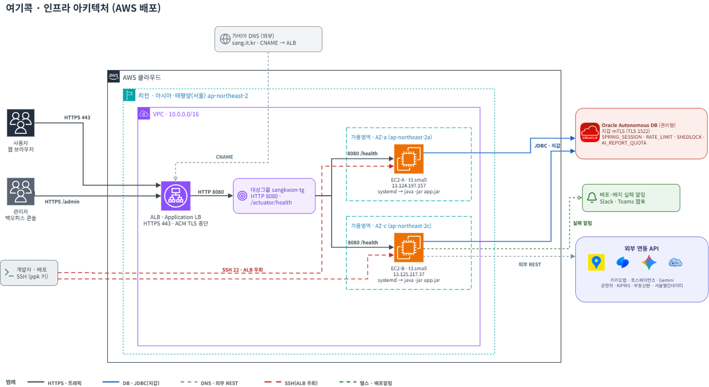

가용영역이 다른 EC2 2대(t3.small)를 ALB 뒤에 두고, ALB가 HTTPS 종단(ACM)과 헬스체크(`/actuator/health`)를 맡는다. 각 서버는 nginx 없이 jar만 systemd로 구동한다. DB는 Oracle Autonomous DB로, mTLS 지갑(1522)으로 접속한다.

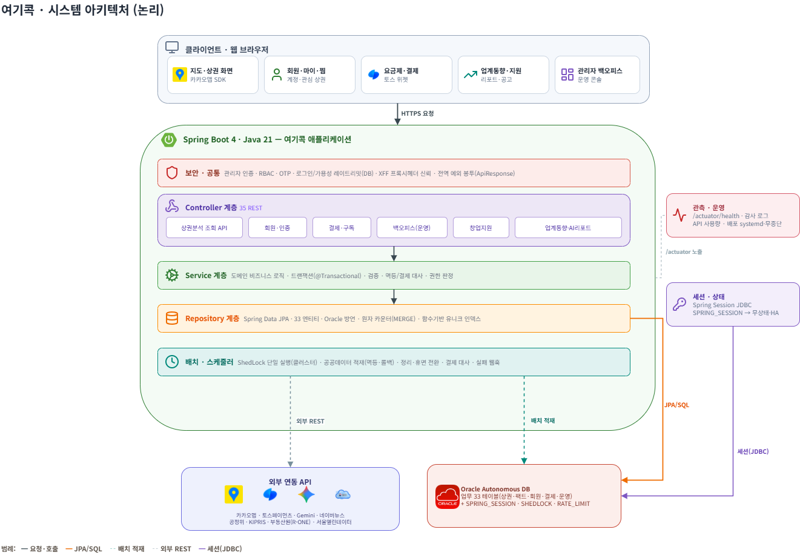

서버를 늘려도 문제없이 동작하도록 상태를 전부 DB로 뺐다. 로그인 세션은 Spring Session JDBC, 스케줄러 중복 실행은 ShedLock, 레이트리밋은 공유 DB 카운터로 처리한다. 그래서 ALB가 어느 서버로 보내든 결과가 같고, 세션 고정 없이 3대, 4대로 늘릴 수 있다.

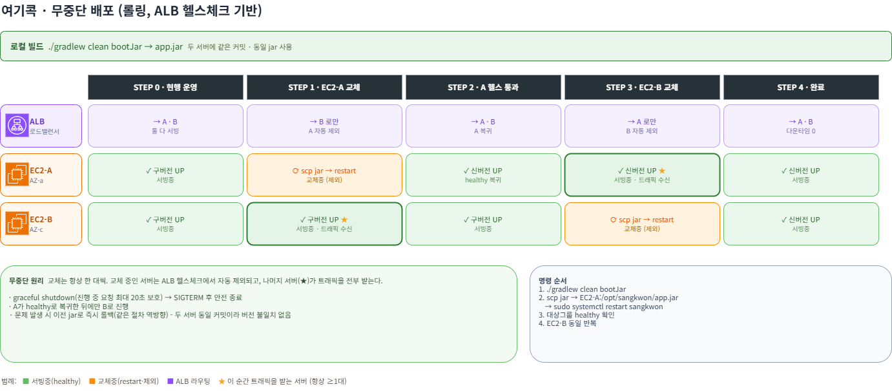

배포는 한 대씩 순차로 교체한다. `graceful shutdown`으로 진행 중 요청을 최대 20초 기다렸다가 내리고, ALB 헬스체크가 교체 중인 서버를 자동으로 대상에서 빼고 나머지가 트래픽을 받는다. 두 서버 모두 같은 커밋으로 빌드한 동일 jar를 올려 버전 불일치를 막는다. 문제가 생기면 이전 jar로 바로 롤백한다.

자세한 배포 절차는 [`docs/배포_ALB_2대_가이드.md`](docs/배포_ALB_2대_가이드.md), HA·FT·형상관리 전략 전체는 [`docs/배포_형상_전략.md`](docs/배포_형상_전략.md)에 정리했다.

## 6. 데이터 모델

Oracle Autonomous DB 19c, 33개 테이블·375개 컬럼. 상권 마스터·차원 테이블에 상권 팩트 8종(추정매출, 유동인구, 점포수, 성장쇠퇴, 집객시설, 아파트, 상가임대료 등)을 붙인 스타 스키마이고, 여기에 프랜차이즈·창업지원·회원·결제·운영 테이블이 딸려 있다.

| 그룹 | 테이블 수 | 예 |
| :--- | :---: | :--- |
| 상권 마스터 · 차원 | 3 | TRDAR, DIM_QUARTER, INDUTY |
| 상권 팩트 | 8 | SALES, STORE_STAT, STREET_POP, RESIDENT_POP |
| 프랜차이즈 | 4 | FRANCHISE_BRAND, FRANCHISE_DISCLOSURE |
| 창업지원 · 동향 | 4 | SUPPORT_PROGRAM, INDUSTRY_NEWS_INSIGHT |
| 회원 · AI · 결제 | 6 | MEMBER, LLM_REPORT, PAYMENT_ORDER |
| 운영 · 보안 | 8 | ADMIN_AUDIT_LOG, API_USAGE_LOG, RATE_LIMIT_BUCKET |

제출 전 테이블 정의서와 실제 DB 컬럼·타입·NULL 제약을 전수 대조해 100% 일치시켰다. ERD와 결제 상태 흐름은 [`docs/설계.md`](docs/설계.md) 참고.

## 7. 신뢰성 · 품질

| 항목 | 결과 |
| :--- | :--- |
| 단위 테스트 | 309건 전체 통과 |
| 통합 테스트 | 33건 중 30건 통과, 3건은 외부 배치 호출이라 테스트 환경상 제외 |
| 정적분석 | SpotBugs + Find Security Bugs 218건 탐지 (High 2 · Medium 54 · Low 162) |

정적분석 결과 대부분은 정보성(SPRING_ENDPOINT 99건)이거나 오탐(SQL 인젝션 3건은 하드코딩된 식별자만 이어붙이고 값은 바인딩해서 비취약)이었다. 실제 조치가 필요했던 건 CSRF 비활성화 1건으로, `CookieCsrfTokenRepository` + `CsrfTokenRequestAttributeHandler`로 토큰 검증을 붙이고 프런트 공통 스크립트(`csrf.js`)로 상태변경 요청에 토큰을 자동 첨부하도록 고쳤다. 관리자 API(`/api/admin/**`)는 IP 허용목록과 세션 인터셉터로 이미 보호돼 있어 CSRF 예외로 뺐다.

## 8. 한계와 개선점

- **학교 Oracle ADB 스키마 용량**: 개발 중에는 개인 Oracle Cloud 지갑을 썼고, 학교 제공 ADB로 최종 이관하려면 스키마 용량 증설이 먼저 필요하다. 제출 시점 기준 미완료.
- **인스턴스 2대 고정**: HA 구조 자체는 대상 그룹에 서버를 추가하면 그대로 수평 확장되지만, 실제로는 t3.small 2대까지만 구성해봤다. AZ 전체 장애 시나리오는 검증하지 못했다.
- **관리자 RBAC 세분화**: 현재는 SUPER_ADMIN과 일반 운영자 정도로만 나뉜다. 담당 도메인별로 권한을 더 쪼갤 여지가 있다.
- **트래픽 레벨 방어 부재**: 로그인 실패 등 일부 레이트리밋은 있지만, WAF나 전역 rate limiting은 없다.
- **정적분석 커버리지**: SpotBugs는 바이트코드 기반 분석이라 런타임 의존적인 취약점(예: 인증 우회 로직 자체의 논리 오류)은 못 잡는다. 실제로 CSRF 건도 정적분석이 아니라 코드 리뷰 과정에서 먼저 발견했다.

## 9. 실무 확장 방안

- **인스턴스 자동 교체**: 현재 무중단 배포는 수동으로 순서를 맞춰 한 대씩 교체한다. Auto Scaling Group + Launch Template으로 헬스체크 실패 시 자동 교체하도록 넘기면 사람 개입을 줄일 수 있다.
- **Multi-AZ 확장**: 지금은 2개 AZ에 EC2 1대씩이라 그 자체로는 이미 AZ 분산이지만, 대상 그룹에 3번째 AZ를 추가하면 한 AZ가 통째로 죽어도 버틸 수 있다.
- **중앙 로깅**: 현재 감사로그·배치로그는 애플리케이션 DB 테이블에 쌓인다. 운영 규모가 커지면 CloudWatch Logs 같은 중앙 로그 저장소로 분리하는 게 조회·보존 면에서 낫다.
- **IaC**: 지금은 EC2·ALB를 콘솔에서 수동으로 구성했다. Terraform으로 코드화하면 재현성과 리뷰가 쉬워진다.

## 10. 디렉터리 구조

```
sangkwon-platform-poly/
├── README.md
├── docs/                        # 설계, 배포, 운영 문서
├── screenshots/                 # 화면 캡처
├── diagrams/                    # 아키텍처 다이어그램
└── src/main/java/com/sangkwon/sangkwonplatform
    ├── global/     공통 (예외처리, 응답포맷, BaseEntity, 외부 API)
    ├── map/        상권 · 지도
    ├── member/     회원 · 인증 · 결제
    ├── admin/      관리자 백오피스
    └── support/    창업지원 · 업계동향
```

## 11. 실행

```bash
cp src/main/resources/application-local.properties.example src/main/resources/application-local.properties
# 위 파일에 DB 계정·API 키 입력 후
./gradlew bootRun --args='--spring.profiles.active=local'
```

DB 지갑 경로 설정 등 세팅 전체는 [`docs/실행_가이드.md`](docs/실행_가이드.md)에 정리했다.

---

## 상세 문서

* [설계 문서](docs/설계.md): 아키텍처, ERD, 결제 상태 흐름
* [배포·형상 전략](docs/배포_형상_전략.md): HA · FT · 무중단 배포 · 형상관리
* [ALB 2대 배포 가이드](docs/배포_ALB_2대_가이드.md)
* [운영 배포 가이드](docs/운영_배포_가이드.md)
* [Git 협업 규칙](docs/GIT_협업규칙.md)
