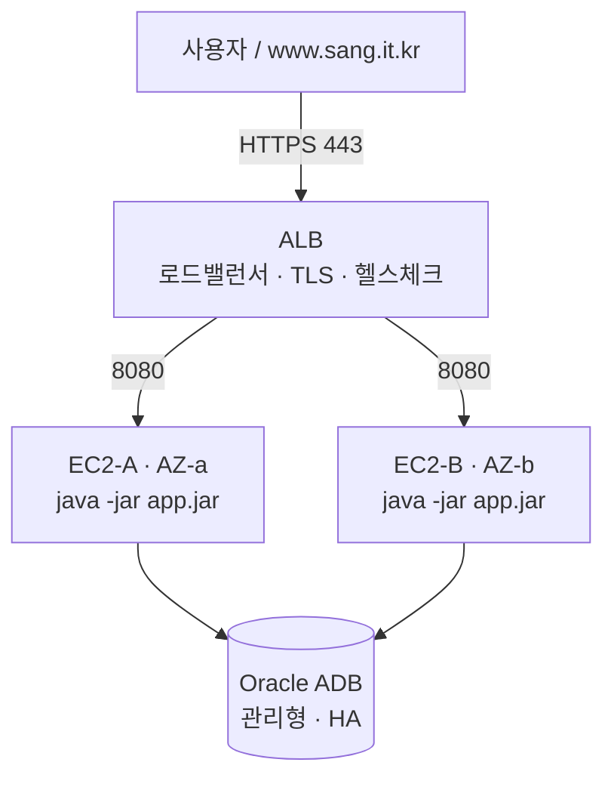

# 배포 가이드: EC2 2대 + ALB (진짜 서버 HA)

서로 다른 가용영역(AZ)의 EC2 2대에 앱을 각각 띄우고, 앞단의 **ALB**가 로드밸런싱·HTTPS·헬스체크를 담당한다.
한 서버가 통째로 죽어도 ALB가 나머지로 넘겨 서비스가 유지된다(인프라 HA).

## 아키텍처



- **ALB**가 nginx 역할(로드밸런싱 + HTTPS)을 대신한다 → **각 EC2는 nginx/Docker 없이 jar만 구동**.
- TLS 인증서는 **ACM(무료)** 을 ALB에 붙인다 → certbot 불필요.
- 앱은 무상태(세션·레이트리밋·스케줄러 전부 DB)라 ALB가 어느 박스로 보내도 정상. 세션 고정 불필요.

## 사전 준비
- 리전은 AZ가 2개 이상인 곳(서울 `ap-northeast-2` 등).
- 도메인 `www.sang.it.kr` (DNS 레코드 편집 가능해야 함).
- **앱 jar를 로컬에서 1번 빌드**(각 t3.small에서 gradle 빌드는 2GB라 OOM 위험 → 빌드는 로컬에서):
  ```bash
  ./gradlew clean bootJar
  ls build/libs/*.jar   # sangkwon-platform-0.0.1-SNAPSHOT.jar (-plain.jar 아님)
  ```

## Step 1. EC2 2대 생성
- 유형 `t3.small`, OS Amazon Linux 2023(또는 Ubuntu 22.04), **서로 다른 서브넷/AZ** 2대(예: A는 ap-northeast-2a, B는 2c).
- 키페어 지정, 퍼블릭 서브넷.
- 보안그룹 **app-SG**(두 EC2에 부여):
  - 인바운드 `8080` ← 소스는 **ALB 보안그룹(alb-SG)만** (공개 금지)
  - 인바운드 `22` ← 내 IP만(SSH)
- Java 21 설치(각 박스):
  ```bash
  sudo dnf install -y java-21-amazon-corretto   # Amazon Linux
  # 또는 Ubuntu: sudo apt-get update && sudo apt-get install -y openjdk-21-jre
  java -version
  ```

## Step 2. 각 EC2에 앱 배치 (2대 모두 동일)
```bash
sudo useradd -r -m -d /opt/sangkwon sangkwon || true
sudo mkdir -p /opt/sangkwon/wallet
# 로컬에서 scp 로 업로드: jar, 지갑 파일들, app.env
scp build/libs/sangkwon-platform-0.0.1-SNAPSHOT.jar  ec2-user@<EC2-IP>:/tmp/app.jar
scp Wallet_DinkDB/*  ec2-user@<EC2-IP>:/tmp/wallet/     # 지갑 파일 일체
# app.env 는 deploy/.env.example 을 채워 만든다(DB_PASSWORD, ADMIN_TRUST_DEVICE_SECRET, SESSION_COOKIE_SECURE=true 등)

sudo mv /tmp/app.jar /opt/sangkwon/app.jar
sudo mv /tmp/wallet/* /opt/sangkwon/wallet/
sudo cp app.env /opt/sangkwon/app.env
sudo chown -R sangkwon:sangkwon /opt/sangkwon && sudo chmod 600 /opt/sangkwon/app.env

# systemd 등록(레포의 deploy/aws-alb/sangkwon.service)
sudo cp deploy/aws-alb/sangkwon.service /etc/systemd/system/
sudo systemctl daemon-reload && sudo systemctl enable --now sangkwon
sudo systemctl status sangkwon
curl -fsS http://localhost:8080/actuator/health   # {"status":"UP"} 확인
```
> Docker로 하고 싶으면 이 Step 대신 `deploy/aws-alb/docker-compose.yml`(앱 컨테이너 1개)로 띄워도 된다. ALB 뒤라 결과는 동일하다.

## Step 3. 대상 그룹(Target Group)
- 유형 **Instances**, 프로토콜 `HTTP` 포트 `8080`.
- 상태 검사(Health check) 경로 `/actuator/health`, 정상 코드 `200`.
- 두 EC2 인스턴스를 등록.

## Step 4. TLS 인증서(ACM)
- ACM에서 `www.sang.it.kr` 인증서 요청 → **DNS 검증**: ACM이 준 CNAME을 도메인 DNS에 추가 → 발급(무료).
- ALB와 **같은 리전**에서 요청해야 한다.

## Step 5. ALB 생성
- 유형 **Application Load Balancer**, 인터넷 경계, **AZ 2개**(EC2가 있는 AZ 포함) 서브넷 지정.
- 보안그룹 **alb-SG**: 인바운드 `443`, `80` ← `0.0.0.0/0`.
- 리스너:
  - `HTTPS:443` → 인증서(Step 4) → 대상 그룹(Step 3)로 전달
  - `HTTP:80` → `HTTPS`로 영구 리다이렉트
- (app-SG의 8080 인바운드 소스를 이 alb-SG로 걸어 두면, 앱은 ALB로만 접근된다)

## Step 6. DNS 연결
- `www.sang.it.kr` **CNAME** → ALB의 DNS 이름(`xxx.ap-northeast-2.elb.amazonaws.com`).
- (Route53이면 A 레코드 Alias로 ALB 지정)

## Step 7. 확인 + 장애 시연(발표용)
```bash
curl -I https://www.sang.it.kr/actuator/health     # 200
```
- **FT 시연**: EC2-A를 **Stop** → ALB 상태 검사가 A를 자동 제외 → 트래픽이 EC2-B로만 → 사이트 무중단. A를 다시 Start 하면 상태 검사 통과 후 자동 복귀.

## 배포(새 버전 반영, 무중단 롤링)
1. 로컬에서 `./gradlew clean bootJar`
2. **EC2-A**에 새 jar scp → `sudo systemctl restart sangkwon` (그동안 ALB가 B로 서빙)
3. A가 상태 검사 통과한 뒤 **EC2-B** 동일 반복
→ 한 대씩 교체해 다운타임 0. graceful shutdown(20s)로 진행 중 요청도 보호.

## 형상·확장 참고
- 두 박스는 **같은 jar**(같은 커밋/태그)를 올려 버전을 일치시킨다.
- 상태가 전부 DB에 있어 박스를 3대, 4대로 늘려도 코드 변경 없이 대상 그룹에 추가만 하면 된다.
- 전체 전략은 [배포_형상_전략.md](배포_형상_전략.md), DB 스키마 변경은 [운영_배포_가이드.md](운영_배포_가이드.md) 참고.
