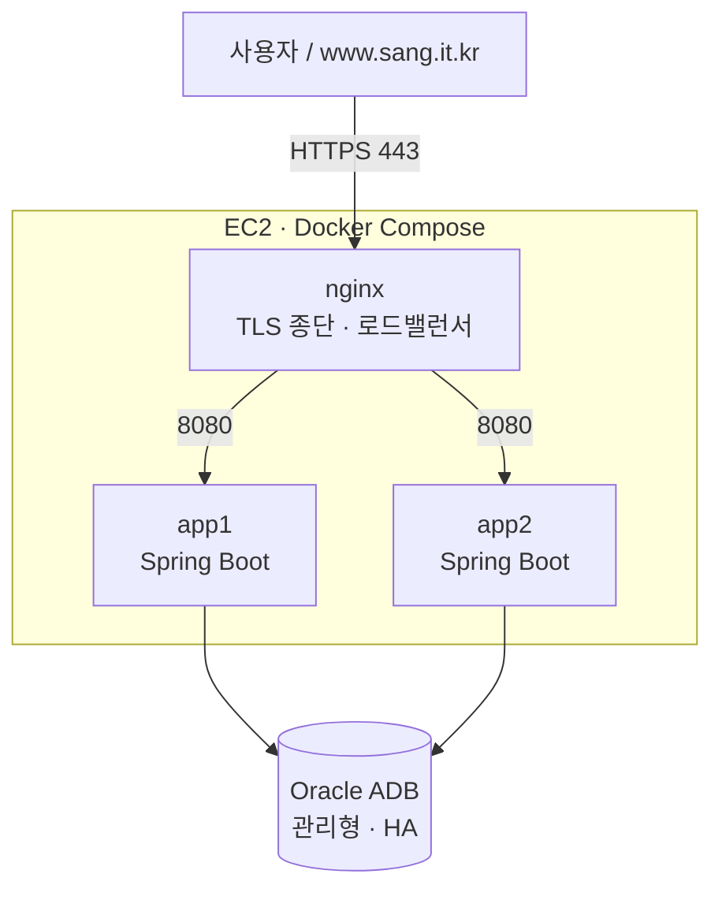

# 배포·형상 전략 (안정 시스템 환경 구축)

여기콕은 **애플리케이션 계층이 상태를 갖지 않도록** 설계돼, 인스턴스를 여러 개 띄워도 안전하다.
이 문서는 그 설계를 실제 배포(HA·FT·무중단 배포·형상 관리)로 어떻게 실현하는지 정리한다.

## 1. 아키텍처



- **nginx**: HTTPS 종단(Let's Encrypt) + 두 앱 인스턴스로 부하 분산.
- **app1 / app2**: 동일한 이미지 2벌. 정적 프론트까지 스프링이 서빙(별도 프론트 배포 없음).
- **Oracle ADB**: 클라우드 관리형 DB. HA에서 가장 어려운 "상태 있는 저장소"가 이미 관리형으로 해결돼 있다.

## 2. HA (고가용성)

앱을 여러 인스턴스로 띄워도 깨지지 않도록 **모든 공유 상태를 외부(DB)로 뺐다.**

| 상태 | 인프로세스였다면 문제 | 외부화 방식 |
|---|---|---|
| 로그인 세션 | 인스턴스마다 세션 분리 → 재로그인 | Spring Session JDBC(`SPRING_SESSION`) |
| 로그인·가용성 레이트리밋 | 인스턴스 수만큼 임계 완화 | 공유 DB 카운터(`RATE_LIMIT_BUCKET`) |
| 스케줄러(배치·정리) | N중 실행 | ShedLock(`SHEDLOCK`)로 단일 실행 |
| 배치 중복 적재 | 동시 DELETE/INSERT 충돌 | 함수기반 유니크 인덱스(`UX_BATCH_JOB_RUNNING`) |
| AI 리포트 한도 | 인스턴스별 카운트 | 원자 카운터(`AI_REPORT_QUOTA`) |

→ 그 결과 **인스턴스는 언제든 추가·제거 가능**하다. nginx `least_conn`으로 두 인스턴스에 분산한다.

## 3. FT (장애 허용)

- nginx `upstream`에 `max_fails=3 fail_timeout=15s` + `proxy_next_upstream`을 걸어, **한 인스턴스가 죽거나 5xx면 자동으로 다른 인스턴스로 재시도**한다.
- 컨테이너 `restart: unless-stopped` + `healthcheck(/actuator/health)`로 죽은 인스턴스는 자동 재기동.
- **시연 방법(발표용)**:
  ```bash
  docker compose kill app1      # 한 인스턴스 강제 종료
  # 브라우저에서 계속 접속 → nginx가 app2로 넘겨 서비스 무중단
  docker compose up -d app1     # 자동 복구
  ```

## 4. 배포 전략 (무중단 롤링)

앱은 `server.shutdown=graceful`(진행 중 요청을 최대 20초 기다렸다 종료)이라 롤링 교체가 안전하다.

```bash
./deploy/deploy.sh
```
1. 새 이미지 빌드
2. `app1` 교체(그동안 `app2`가 서빙) → 헬스 통과 대기
3. `app2` 교체(그동안 `app1`이 서빙) → 헬스 통과 대기

→ 두 인스턴스를 한 대씩 갈아끼워 **다운타임 0**. 문제 시 이전 이미지 태그로 롤백.

## 5. 형상 전략 (구성·버전 관리)

- **소스**: Git(GitHub). `develop` 통합 → PR 리뷰 → `main` 릴리스. 릴리스는 태그(`v1.0.0`)로 고정.
- **환경 분리**: Spring 프로파일(`local`/`prod`). prod는 secure 쿠키·프록시 헤더 신뢰·신뢰기기 시크릿 강제.
- **시크릿**: `deploy/.env`(git 제외) + Oracle 지갑(git 제외, 볼륨 마운트). 예시는 `deploy/.env.example`.
- **DB 스키마**: `ddl-auto=none` + **증분 마이그레이션 스크립트**(`scripts/db/`, 날짜순, idempotent). 신규 DB는 `schema.sql`, 기존 DB는 증분 SQL만. 상세는 [운영_배포_가이드.md](운영_배포_가이드.md).
- **이미지**: `sangkwon-platform:latest`(+ 릴리스마다 버전 태그 권장).

## 6. 확장 경로 (정직한 한계)

현재 구성은 **EC2 1대** 위에서 앱 2 인스턴스를 돌린다. 앱 계층의 HA/FT·무중단 배포는 실증되지만, **EC2 인스턴스 자체는 단일 장애점**이다. 애플리케이션이 이미 무상태이므로 다음 단계는 인프라만 바꾸면 된다:

- 앱 인스턴스를 **2개 가용영역(AZ)의 EC2**로 분리 + **ALB**로 분산 → 인프라 HA.
- 세션·레이트리밋·스케줄러가 이미 DB 공유라 **코드 변경 없이** 수평 확장 가능.
- DB는 이미 Oracle ADB(관리형·자동 백업/패치)라 별도 조치 불필요.

## 7. 최초 배포 절차

사전: EC2(보안그룹 22/80/443, Elastic IP), `www.sang.it.kr` A레코드 → Elastic IP, Docker/Compose 설치.

```bash
# 1) 소스·지갑·시크릿 준비
git clone <repo> && cd sangkwon-platform
mkdir -p wallet && (지갑 파일들을 ./wallet 에 업로드)
cp deploy/.env.example deploy/.env && (deploy/.env 값 채우기)

# 2) TLS 인증서 발급(nginx 뜨기 전, 80 포트 비어 있을 때)
sudo certbot certonly --standalone -d www.sang.it.kr

# 3) 스택 기동(nginx + app1 + app2)
docker compose up -d --build
docker compose ps            # 세 서비스 healthy 확인

# 4) 확인
curl -I https://www.sang.it.kr/actuator/health
```

인증서 갱신(90일): `sudo certbot renew --pre-hook "docker compose -f <경로>/docker-compose.yml stop nginx" --post-hook "docker compose -f <경로>/docker-compose.yml start nginx"` 를 cron에 등록.

## 8. 관측·헬스

- `/actuator/health`: nginx·compose 헬스체크가 사용. `UP`이면 DB 연결까지 정상.
- 배치 실패는 웹훅(`OPS_ALERT_WEBHOOK_URL`)으로 Slack 알림.
- 관리자 콘솔의 데이터 적재·API 사용량·감사 로그 화면으로 운영 상태를 직접 관찰.
