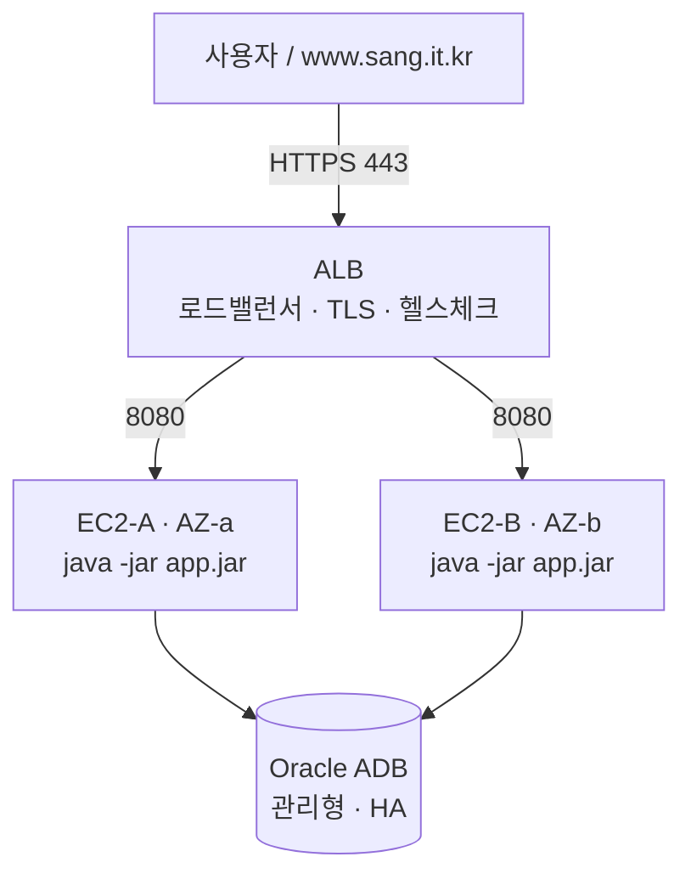

# 배포·형상 전략 (안정 시스템 환경 구축)

여기콕은 **애플리케이션 계층이 상태를 갖지 않도록** 설계돼, 서버를 여러 대로 늘려도 안전하다.
이 문서는 그 설계를 실제 배포(HA·FT·무중단 배포·형상 관리)로 어떻게 실현하는지 정리한다.

## 1. 아키텍처 (운영: EC2 2대 + ALB)

서로 다른 가용영역(AZ)의 EC2 2대에 앱을 각각 구동하고, 앞단의 **ALB**가 로드밸런싱·HTTPS·헬스체크를 담당한다.
한 서버가 통째로 죽어도 ALB가 나머지로 넘겨 서비스가 유지된다.

- **ALB**가 로드밸런싱 + HTTPS 종단을 맡는다 → 각 EC2는 nginx/Docker 없이 **jar만 구동**(systemd).
- TLS는 **ACM 무료 인증서**를 ALB에 붙인다(certbot 불필요).
- **Oracle ADB**는 클라우드 관리형 DB. HA에서 가장 어려운 "상태 있는 저장소"가 이미 관리형으로 해결돼 있다.

구체 절차는 [배포_ALB_2대_가이드.md](배포_ALB_2대_가이드.md) 참고.

## 2. HA (고가용성)

서버를 여러 대로 늘려도 깨지지 않도록 **모든 공유 상태를 외부(DB)로 뺐다.**

| 상태 | 인프로세스였다면 문제 | 외부화 방식 |
|---|---|---|
| 로그인 세션 | 서버마다 세션 분리 → 재로그인 | Spring Session JDBC(`SPRING_SESSION`) |
| 로그인·가용성 레이트리밋 | 서버 수만큼 임계 완화 | 공유 DB 카운터(`RATE_LIMIT_BUCKET`) |
| 스케줄러(배치·정리) | N중 실행 | ShedLock(`SHEDLOCK`)로 단일 실행 |
| 배치 중복 적재 | 동시 DELETE/INSERT 충돌 | 함수기반 유니크 인덱스(`UX_BATCH_JOB_RUNNING`) |
| AI 리포트 한도 | 서버별 카운트 | 원자 카운터(`AI_REPORT_QUOTA`) |

→ 앱이 무상태라 ALB가 어느 서버로 보내도 정상 동작한다(세션 고정 불필요). 서버를 **3대, 4대로 늘려도 코드 변경 없이** 대상 그룹에 추가만 하면 된다.

## 3. FT (장애 허용)

- **ALB 상태 검사**(`/actuator/health`, 30초 주기)가 죽은 서버를 자동으로 제외하고 살아난 서버를 자동 복귀시킨다.
- 앱은 `systemd Restart=always` + `-XX:+ExitOnOutOfMemoryError`로, OOM/크래시 시 자동 재기동.
- **시연 방법(발표용)**: EC2-A를 **Stop** → ALB가 A를 제외하고 EC2-B로만 라우팅 → 사이트 무중단 → A를 Start 하면 상태 검사 통과 후 자동 복귀.

## 4. 배포 전략 (무중단 롤링)

앱은 `server.shutdown=graceful`(진행 중 요청을 최대 20초 기다렸다 종료)이라 한 대씩 교체해도 안전하다.

1. 로컬에서 `./gradlew clean bootJar`로 새 jar 생성(서버에서 빌드하지 않아 리소스·시간 절약).
2. **EC2-A** 새 jar 반영 후 `systemctl restart sangkwon`(그동안 ALB가 B로 서빙).
3. A가 상태 검사 통과하면 **EC2-B** 동일 반복.

→ 다운타임 0. 문제 시 이전 jar로 롤백.

## 5. 형상 전략 (구성·버전 관리)

- **소스**: Git(GitHub). `develop` 통합 → PR 리뷰 → `main` 릴리스. 릴리스는 태그(`v1.0.0`)로 고정.
- **아티팩트**: 두 서버에 **같은 커밋/태그로 빌드한 동일 jar**를 올려 버전을 일치시킨다.
- **환경 분리**: Spring 프로파일(`local`/`prod`). prod는 secure 쿠키·프록시 헤더 신뢰·신뢰기기 시크릿 강제.
- **시크릿**: `app.env`(git 제외) + Oracle 지갑(git 제외). 예시는 `deploy/.env.example`.
- **DB 스키마**: `ddl-auto=none` + **증분 마이그레이션 스크립트**(`scripts/db/`, 날짜순, idempotent). 상세는 [운영_배포_가이드.md](운영_배포_가이드.md).

## 6. 트래픽 헤더·보안 정합

- ALB가 `X-Forwarded-For`에 실 클라이언트 IP를 오른쪽 끝에 append, `X-Forwarded-Proto=https`를 전달한다.
- 앱 prod는 `forward-headers-strategy=framework` + `admin.security.trust-forwarded-for=true`(오른쪽 값 신뢰, 1홉 전제)로 이를 정확히 해석 → 관리자 IP 허용목록·레이트리밋이 실 IP 기준으로 동작하고, secure 쿠키가 켜진다.
- 앱 포트(8080)는 **ALB 보안그룹에서만** 인바운드 허용(공개 금지).

## 7. 확장·대안

- **인프라 HA는 이미 달성**(2 AZ EC2 + ALB). 필요하면 대상 그룹에 서버를 추가해 수평 확장.
- **간단 대안(개발·소규모)**: EC2 1대에서 `docker-compose.yml`(nginx + app1 + app2 컨테이너 2개)로도 앱 계층 HA/FT를 시연할 수 있다. 이 경우 서버 자체는 단일 장애점이며, 위 2 AZ + ALB 구성이 그 확장형이다.

## 8. 관측·헬스

- `/actuator/health`: ALB 상태 검사가 사용. `UP`이면 DB 연결까지 정상.
- 배치 실패는 웹훅(`OPS_ALERT_WEBHOOK_URL`)으로 Slack 알림.
- 관리자 콘솔의 데이터 적재·API 사용량·감사 로그 화면으로 운영 상태를 직접 관찰.
