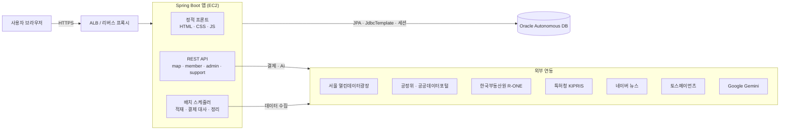
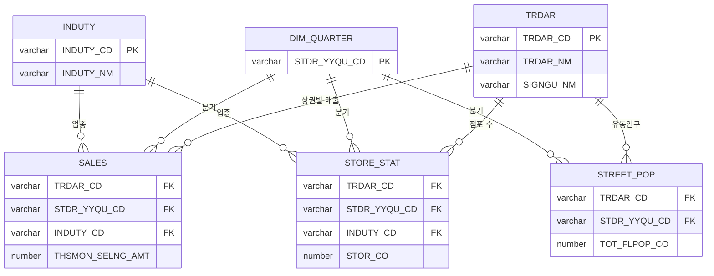
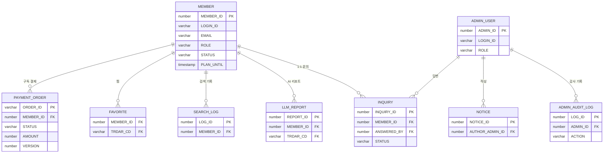
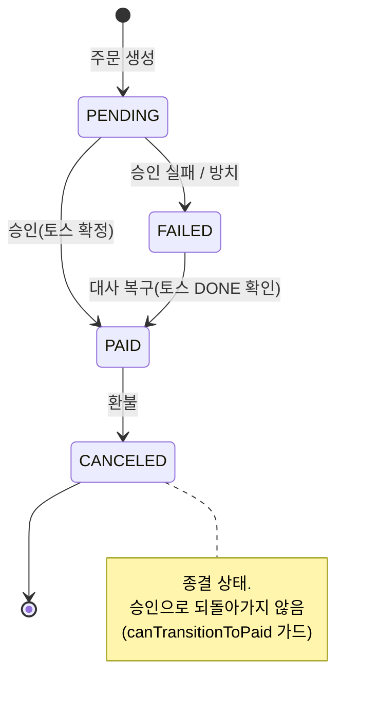

# 여기콕 설계 문서

시스템 아키텍처와 데이터 모델(ERD). GitHub에서 다이어그램이 바로 렌더링됩니다.

## 시스템 아키텍처

- **정적 프론트**: 빌드 툴 없는 순수 HTML/CSS/JS. `common.css` 토큰 시스템을 공유하고 화면별 CSS/JS는 폴더가 소유.
- **인증/세션**: Spring Security 세션 기반. 세션은 `SPRING_SESSION` 테이블에 영속화(재배포·다중 인스턴스에도 로그인 유지, 스티키 세션 불필요).
- **배치**: 관리자 수동 트리거 + 스케줄(결제 대사·휴면 전환·이력/사용량 정리). 실행 이력은 `BATCH_JOB_LOG`, 실패는 웹훅 알림.
- **프록시 전제**: 운영은 ALB 1홉 뒤. 클라이언트 IP는 신뢰 프록시가 찍은 XFF의 가장 오른쪽 값만 사용(허용목록·레이트리밋 스푸핑 방지).

## 데이터 모델 (ERD)

### 1) 상권 데이터: 스타 스키마

`TRDAR`(상권)·`DIM_QUARTER`(분기)·`INDUTY`(업종)를 차원으로, 팩트 테이블이 이를 참조합니다. 아래는 대표 팩트이며 **매출·점포·유동인구·상주인구·집객·상권변화·아파트·임대료 8종이 같은 구조**를 따릅니다.

### 2) 서비스 도메인: 회원 · 결제 · 관리자

전체 컬럼과 제약(CHECK·UNIQUE·FK)은 [`src/main/resources/db/schema.sql`](../src/main/resources/db/schema.sql)에 있습니다(도메인 30개 + 세션 2개 테이블).

## 결제 상태 흐름

